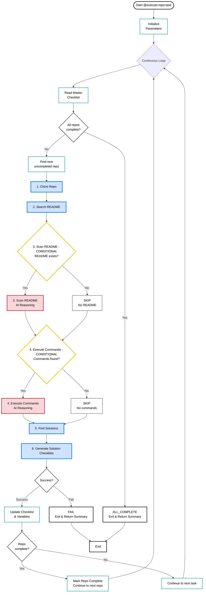

# Execute-Repo-Task Workflow Diagram

This diagram shows the workflow for the `@execute-repo-task` prompt, including task execution order, conditions, and scriptable vs non-scriptable tasks.

## Task Execution Overview

### Mandatory Tasks (Always Execute in Order)
1. **Clone Repository** [SCRIPTABLE] - Generates Python script
2. **Search README** [SCRIPTABLE] - Generates Python script  
5. **Find Solutions** [SCRIPTABLE] - Generates Python script
6. **Generate Solution Checklists** [SCRIPTABLE] - Generates Python script

### Conditional Tasks (Execute Based on Conditions)
3. **Scan README** [CONDITIONAL] - Requires AI reasoning
   - **Condition:** README content exists 
   - **If TRUE:** Execute with AI reasoning
   - **If FALSE:** Skip task

4. **Execute Commands** [CONDITIONAL] - Requires AI reasoning
   - **Condition:** Commands found in README
   - **If TRUE:** Execute with AI reasoning  
   - **If FALSE:** Skip task

## Key Workflow Features

- **Sequential Execution:** Tasks run in strict order (1→2→3→4→5→6)
- **Autonomous Loop:** Processes all repos continuously  
- **Conditional Logic:** Smart skipping based on content availability
- **Error Handling:** Stops on failure or missing dependencies
- **Resumable:** Can restart from any checkpoint

## Color Legend
- 🟢 **Green:** Mandatory scriptable tasks
- 🟡 **Yellow:** Conditional decision points  
- 🔵 **Blue:** Scriptable automation tasks
- 🔴 **Red:** AI reasoning required tasks
- ⚪ **Gray:** Process steps and decisions