# Execute-Solution-Task Workflow Diagram

This diagram shows the workflow for the `@execute-solution-task` prompt, including task execution order, conditions, and scriptable vs non-scriptable tasks.

```mermaid
flowchart TD
    Start([Start @execute-solution-task]) --> Init[Initialize<br/>CSV Tracking]
    
    Init --> Loop{Continuous Loop}
    
    Loop --> ReadChecklist[Read Solution<br/>Checklist Files]
    
    ReadChecklist --> CheckAllSolutions{All solutions<br/>complete?}
    CheckAllSolutions -->|Yes| AllComplete[ALL_COMPLETE<br/>Exit & Return Summary]
    CheckAllSolutions -->|No| FindFirstTask[Find next<br/>uncompleted task]
    
    FindFirstTask --> RestoreSolution[1. Restore Solution]
    
    %% Sequential Task Execution
    RestoreSolution --> BuildSolution[2. Build Solution]
    
    %% Conditional Tasks
    BuildSolution --> CheckBuildFailed{3. Search KB - CONDITIONAL<br/>Restore or Build failed?}
    CheckBuildFailed -->|Yes| SearchKB[3. Search KB<br/>AI Reasoning]
    CheckBuildFailed -->|No| SkipSearchKB[SKIP<br/>Build succeeded]
    
    SearchKB --> CheckKBFound{4. Create KB - CONDITIONAL<br/>KB not found?}
    SkipSearchKB --> CheckKBFound
    CheckKBFound -->|Yes| CreateKB[4. Create KB<br/>AI Reasoning]
    CheckKBFound -->|No| SkipCreateKB[SKIP<br/>KB exists]
    
    %% Retry Loop (Attempts 1-3)
    CreateKB --> CheckHasKB{5. Apply Fix - CONDITIONAL<br/>KB found or created?}
    SkipCreateKB --> CheckHasKB
    CheckHasKB -->|Yes| ApplyFix[5-9. Apply Fix<br/>AI Reasoning<br/>Attempts 1-3]
    CheckHasKB -->|No| SkipApplyFix[SKIP<br/>No KB available]
    
    ApplyFix --> CheckFixApplied{6. Retry Build - CONDITIONAL<br/>Fix applied?}
    SkipApplyFix --> CheckFixApplied
    CheckFixApplied -->|Yes| RetryBuild[6-10. Retry Build<br/>Attempts 1-3]
    CheckFixApplied -->|No| SkipRetryBuild[SKIP<br/>No fix applied]
    
    RetryBuild --> CheckRetryResult{Build<br/>succeeded?}
    CheckRetryResult -->|No & attempts < 3| ApplyFix
    CheckRetryResult -->|Yes or attempts >= 3| ContinueAfterRetry[Continue]
    SkipRetryBuild --> ContinueAfterRetry
    
    %% Task Results
    ContinueAfterRetry --> TaskResult{Success?}
    
    TaskResult -->|Success| UpdateChecklist[Update Checklist<br/>& Variables]
    TaskResult -->|Fail| TaskFailed[FAIL<br/>Exit & Return Summary]
    
    UpdateChecklist --> CheckSolutionComplete{Solution<br/>complete?}
    CheckSolutionComplete -->|Yes| MarkSolutionComplete[Mark Solution Complete<br/>Continue to next solution]
    CheckSolutionComplete -->|No| NextTask[Continue to next task]
    
    MarkSolutionComplete --> Loop
    NextTask --> Loop
    
    %% Exit States
    TaskFailed --> End([End])
    AllComplete --> End
    
    %% High Contrast Styling for Presentations
    classDef mandatory fill:#ffffff,stroke:#28a745,stroke-width:3px,color:#000000
    classDef conditional fill:#ffffff,stroke:#ffc107,stroke-width:3px,color:#000000
    classDef scriptable fill:#cfe2ff,stroke:#007bff,stroke-width:3px,color:#000000
    classDef aiReasoning fill:#f8d7da,stroke:#dc3545,stroke-width:3px,color:#000000
    classDef decision fill:#ffffff,stroke:#6c757d,stroke-width:3px,color:#000000
    classDef process fill:#ffffff,stroke:#17a2b8,stroke-width:2px,color:#000000
    classDef terminal fill:#ffffff,stroke:#343a40,stroke-width:3px,color:#000000
    classDef skip fill:#ffffff,stroke:#6c757d,stroke-width:2px,color:#000000
    
    class RestoreSolution,BuildSolution,RetryBuild mandatory
    class CheckBuildFailed,CheckKBFound,CheckHasKB,CheckFixApplied conditional
    class RestoreSolution,BuildSolution,RetryBuild scriptable
    class SearchKB,CreateKB,ApplyFix aiReasoning
    class CheckAllSolutions,TaskResult,CheckSolutionComplete,CheckRetryResult decision
    class Init,ReadChecklist,FindFirstTask,UpdateChecklist,MarkSolutionComplete,NextTask,ContinueAfterRetry process
    class Start,End,AllComplete,TaskFailed terminal
    class SkipSearchKB,SkipCreateKB,SkipApplyFix,SkipRetryBuild skip
```

## Task Execution Overview

### Mandatory Tasks (Always Execute in Order)
1. **Restore Solution** [SCRIPTABLE] - Calls @task-restore-solution
2. **Build Solution** [SCRIPTABLE] - Calls @task-build-solution  
6-10. **Retry Build** [SCRIPTABLE] - Calls @task-build-solution (up to 3 attempts)

### Conditional Tasks (Execute Based on Conditions)
3. **Search KB** [CONDITIONAL] - Requires AI reasoning
   - **Condition:** Restore failed OR Build failed
   - **If TRUE:** Execute with AI reasoning
   - **If FALSE:** Skip task

4. **Create KB** [CONDITIONAL] - Requires AI reasoning
   - **Condition:** KB search returned NOT_FOUND
   - **If TRUE:** Execute with AI reasoning
   - **If FALSE:** Skip task (KB exists)

5-9. **Apply Fix (Retry Loop)** [CONDITIONAL] - Requires AI reasoning
   - **Condition:** KB found OR KB created
   - **If TRUE:** Execute with AI reasoning (loops up to 3 times with different KB options)
   - **If FALSE:** Skip task (no KB available)
   - **Loop:** Continues until build succeeds or max 3 attempts reached

6-10. **Retry Build (Retry Loop)** [CONDITIONAL] - Requires task prompt
   - **Condition:** Fix was applied in current attempt
   - **If TRUE:** Execute @task-build-solution
   - **If FALSE:** Skip task (no fix applied)
   - **Loop:** After each retry, if build fails and attempts < 3, loop back to Apply Fix

## Key Workflow Features

- **Sequential Execution:** Tasks run in strict order (1→2→3→4→5-10 retry loop)
- **Autonomous Loop:** Processes all solutions in all checklist files continuously
- **Conditional Logic:** Smart skipping based on build status and KB availability
- **Retry Loop:** Up to 3 attempts to apply different KB fix options (tasks 5-10 loop)
- **Error Handling:** Stops on max retries or missing dependencies
- **Resumable:** Can restart from any checkpoint using checklist state

## Color Legend
- 🟢 **Green:** Mandatory tasks (always execute)
- 🟡 **Yellow:** Conditional decision points  
- 🔵 **Blue:** Scriptable tasks (call task prompts that may generate scripts)
- 🔴 **Red:** AI reasoning required tasks
- ⚪ **Gray:** Process steps and decisions
